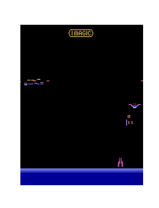

# DQN DemonAttack

<p align="center">
  
</p>

<p align="center"><em>(Agent trained after ~800 episodes and 1 million frames)</em></p>


## Project Summary


> This project follows [DQN: Playing Atari with Deep Reinforcement Learning (Mnih et al., 2013)](https://arxiv.org/abs/1312.5602) as a foundation, which sparked my interest in deep reinforcement learning and inspired this implementation for the DemonAttack Atari environment.

The purpose of this project is to explore and implement a Deep Q-Network (DQN) agent to play the Atari game DemonAttack using modern reinforcement learning techniques. The codebase supports advanced features such as Double DQN, Dueling Networks, Prioritized Experience Replay (PER), n-step returns, and Noisy Networks (NoisyNets) for improved exploration. It is designed for long, resumable training runs with comprehensive logging, checkpointing, and visualization tools.

**Key Features:**
- Double DQN, Dueling DQN, n-step returns, and Prioritized Experience Replay (PER)
- Optional NoisyNets for exploration (enable with `--noisy`)
- Robust checkpointing and seamless resume (with frame counting)
- Per-episode logging to CSV and TensorBoard
- Visualization scripts for training progress and agent gameplay (GIF export)
- Replay buffer
- Compatible with Gymnasium and ALE Atari environments

## Tech Stack

- **Python 3.10+**
- **PyTorch** (deep learning)
- **Gymnasium** (Atari environment)
- **matplotlib** (plotting, GIF export)
- **TensorBoard** (training visualization)
- **NumPy, pandas** (data handling)
- **ale-py** (Arcade Learning Environment backend)

## Usage

**Train a DQN agent:**
```zsh
python main.py
```

**Train with NoisyNets:**
```zsh
python main.py --noisy
```

**Resume training from a checkpoint:**
```zsh
python main.py --resume models/model.pth
```

**Visualize a trained agent and export GIFs:**
```zsh
python visualize.py --model models/model.pth --episodes 1 --render rgb_array
```

**Plot training progress:**
```zsh
python plot_progress.py --dir results
```

## Requirements

See `requirements.txt` for all dependencies. Recommended: use a virtual environment or conda.

## Project Structure

- `main.py` — Main training loop, logging, checkpointing
- `dqn_agent.py` — DQN agent logic (Double DQN, Dueling, PER, n-step, NoisyNets)
- `model.py` — Q-network architectures
- `replay_buffer.py` — Replay buffer and PER
- `utils.py`, `debug_utils.py` — Logging, plotting, debugging
- `visualize.py`, `plot_progress.py`, `visualize_training.py` — Visualization tools
- `results/` — Logs, plots, GIFs, TensorBoard events
- `models/` — Saved checkpoints (NoisyNet models in `models/noisy_models/`)


## References

- [DQN: Playing Atari with Deep Reinforcement Learning (Mnih et al., 2013)](https://arxiv.org/abs/1312.5602)
- [DemonAttack ALE environment documentation](https://ale.farama.org/environments/demon_attack/)
- [Demon Attack Atari manual (AtariAge)](https://atariage.com/manual_html_page.php?SoftwareLabelID=135)

---
Spring 2025